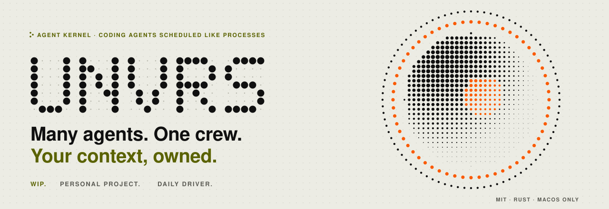
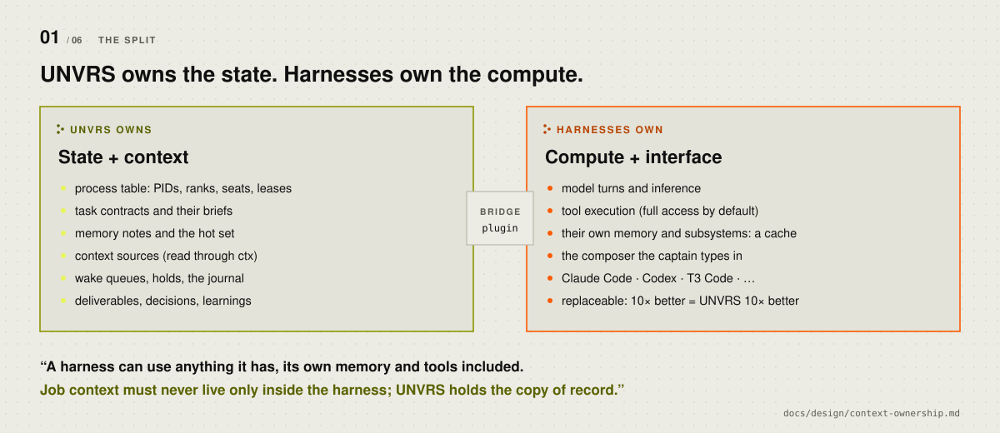
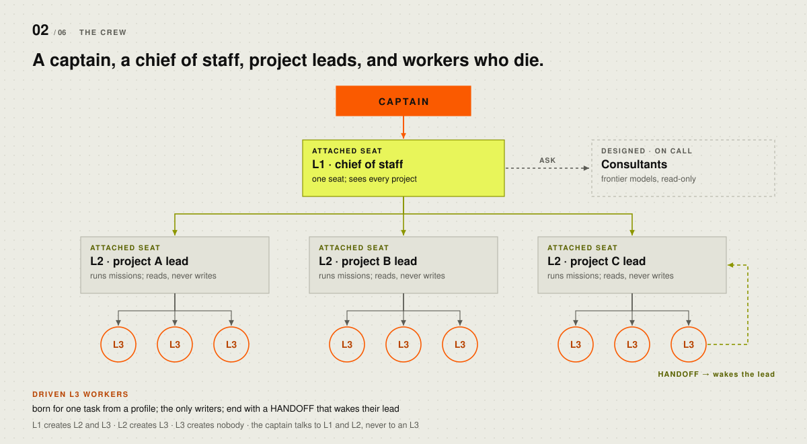
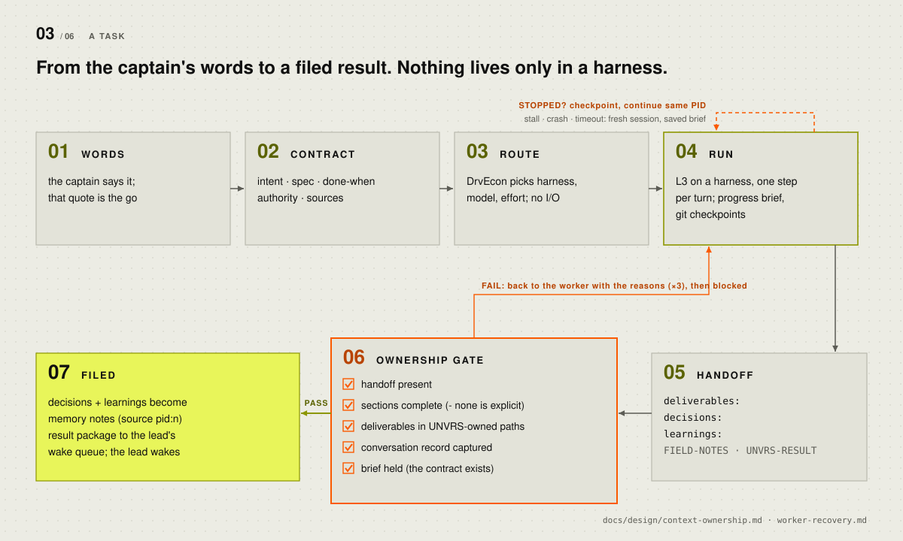
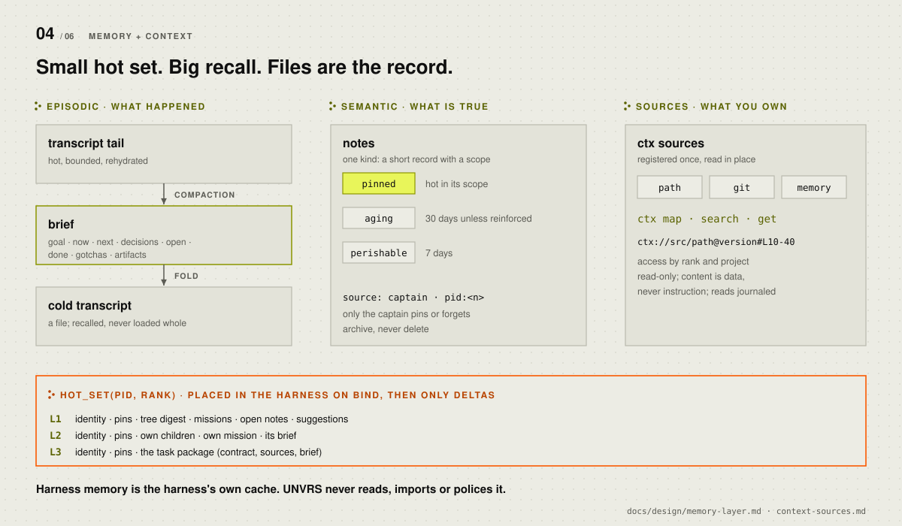
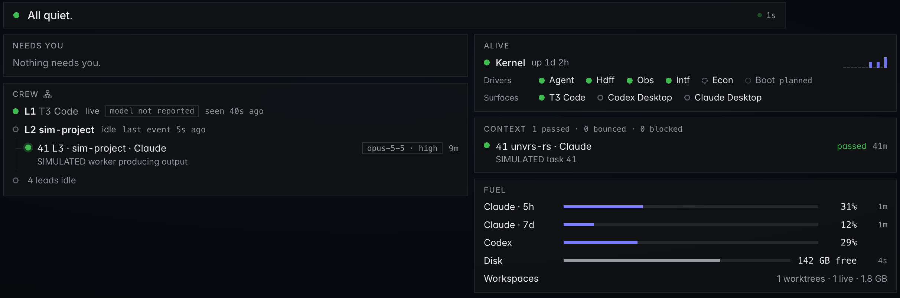
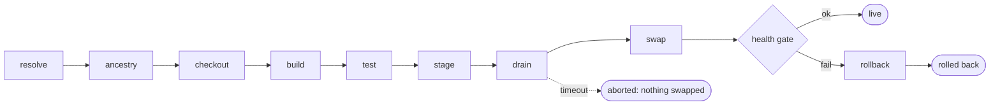
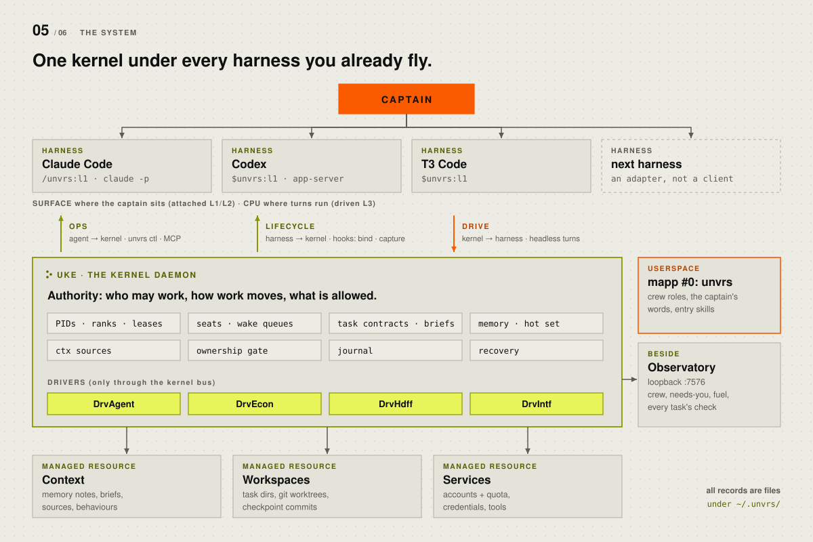
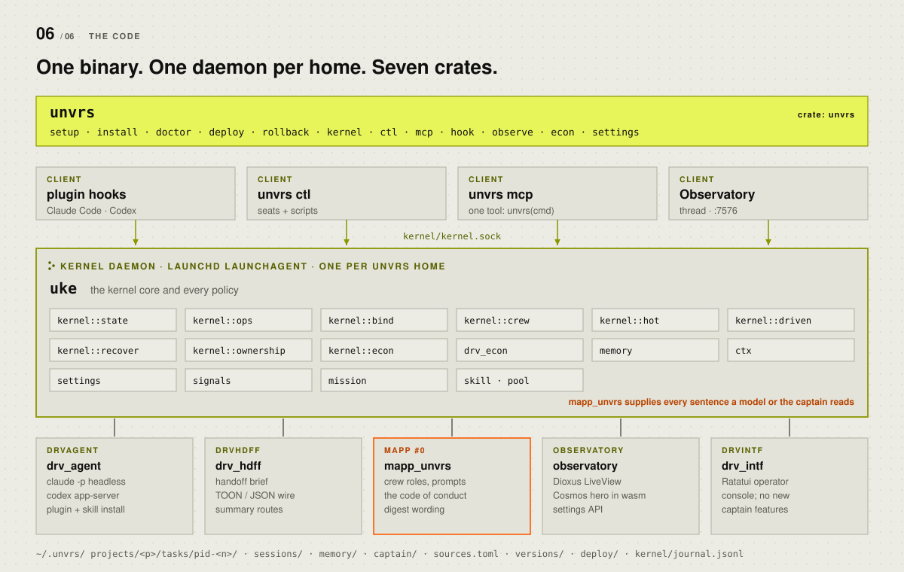

<picture>
  <source media="(prefers-color-scheme: dark)" srcset="docs/assets/readme/hero-dark.svg">
  
</picture>

<p>
  <a href="LICENSE"></a>
  
  
  
</p>

**UNVRS** is an agent kernel: a Rust harness that schedules coding agents (Claude, Codex)
like processes. Its kernel daemon, **uKe**, runs under the agent apps I already use (Claude
Code, Codex, T3 Code) and turns their sessions into one crew: a chief of staff, a lead per
project, and workers that do one task each and report back.

**Status: work in progress, personal project, my daily driver, macOS only.**

> [!NOTE]
> This is my own tooling, built for how I work. It is a userspace program, not an OS
> kernel: the vocabulary (PIDs, scheduler, wakes) is borrowed on purpose. See
> [Status](#06--status) for what is a working prototype and what is not.

<br>

**01** [Why](#01--why) &nbsp;·&nbsp; **02** [The idea](#02--the-idea) &nbsp;·&nbsp; **03** [How it works](#03--how-it-works) &nbsp;·&nbsp; **04** [Architecture](#04--architecture) &nbsp;·&nbsp; **05** [Try it](#05--try-it) &nbsp;·&nbsp; **06** [Status](#06--status) &nbsp;·&nbsp; **07** [Design docs](#07--design-docs) &nbsp;·&nbsp; **08** [License](#08--license)

---

## 01 · Why

I run a lot of Claude Code and Codex sessions at once, across several projects. Each agent
app keeps its own memory, sessions and skills in its own files. That works for one thread
and breaks as soon as the work is bigger than a thread:

- **Context is locked in.** A decision made in a Codex thread is invisible to Claude Code.
  Switching tools means re-explaining, copy-pasting, or guessing which tool still remembers.
- **Nobody owns the job.** A worker finishes and its plan and half its deliverables sit in
  a transcript under `~/.claude` or `~/.codex`, where no other worker will ever look.
- **Quota is a wall.** When a subscription runs out mid-task, the task stops instead of
  moving to the next harness with its state intact.
- **Supervision costs turns.** Someone has to keep asking "is it done yet?".

So I built my own tooling, and borrowed the shape from the thing I know best: an operating
system kernel. One rule sums it up:

> **A harness can use anything it has, its own memory and tools included. Job context must
> never live only inside the harness; UNVRS holds the copy of record.**

And one test keeps the scope small: *if models and harnesses get ten times better, does
this feature become more valuable, or obsolete?* UNVRS only builds the first kind. A better
harness makes UNVRS better.

## 02 · The idea

<picture>
  <source media="(prefers-color-scheme: dark)" srcset="docs/assets/readme/split-dark.svg">
  
</picture>

UNVRS is two halves that only work together:

| | Half | What it means |
|---|---|---|
| **1** | **Owned context** | Memory, briefs, sources and behaviours live once, in `~/.unvrs`. Every harness gets a projection. Harness copies are a cache. |
| **2** | **Mobile work** | PIDs, ranks, contracts, handoff and swap let work run on every harness and subscription I have, and move between them without losing its place. |

The vocabulary is borrowed from operating systems. A **harness** is a CPU. A **PID** wraps
one agent: identity, mailbox, durable session, rank. The **kernel** decides who may work and
whether work is allowed; it never runs a model turn itself. Rule of thumb: *if it decides
who may work or whether work is allowed, UNVRS owns it. If it runs a turn, use the harness.*

## 03 · How it works

### The crew

<picture>
  <source media="(prefers-color-scheme: dark)" srcset="docs/assets/readme/crew-dark.svg">
  
</picture>

| Seat | Who | Lives | Writes project files |
|---|---|---|---|
| **Captain** | me (the human); decides and approves | — | yes |
| **L1** | chief of staff: knows the captain and every project, routes work, writes the digest | one permanent seat | no |
| **L2** | project lead: owns one project's context, missions and workers | as long as the project | no |
| **L3** | a worker built for one task | born for the task, ends with it | **yes**, in its task work tree |

L1 and L2 are **attached seats**: the captain's own thread in Claude Code, Codex or T3 Code,
bound to a PID by the UNVRS plugin. L3s are **driven seats**: the kernel starts the harness
headless (`claude -p`, the Codex app server), sends every turn, and reads every reply. The
captain never talks to an L3. Exactly three ranks: L1 creates L2s and L3s, an L2 creates L3s,
an L3 creates nobody.

From any harness composer:

| Command | Does |
|---|---|
| `$unvrs:l1` · `/unvrs:l1` in Claude Code | make this thread L1 (the seat moves here, rehydrated) |
| `$unvrs:l2 [project]` | list projects, or make this thread a project's lead |
| `$unvrs:digest` | your calls, delivered, under way, next |
| `$unvrs:answer <id> <words>` · `$unvrs:approve <id>` | close a held decision or proposal in your own words |
| `$unvrs:remember <fact>` · `$unvrs:forget <id>` | tell UNVRS something once; archive it |
| `$unvrs:away <words> [--cap n]` · `$unvrs:away off` | let L1 run on its own within a spend cap |
| `$unvrs:observe` · `$unvrs:tree` · `$unvrs:detach` | open the Observatory, show the crew, release the seat |

Captain-only verbs come from the captain's keyboard. A model cannot type them for itself.
Seats and workers use one tool, `unvrs ctl` (or the `unvrs` MCP tool for hosts without a
shell): `ctx search`, `remember`, `recall`, `decide`, `task`, `send`, `stop`, `digest`,
`tree`, `econ explain`.

### A task, end to end

<picture>
  <source media="(prefers-color-scheme: dark)" srcset="docs/assets/readme/lifecycle-dark.svg">
  
</picture>

1. **Words.** Work starts from the captain. The quote that authorized it, the *go*, travels
   with the task, and a worker may delegate only inside it.
2. **Contract.** `unvrs ctl task` writes `contract.json`: the captain's intent, the lead's
   spec, a one-line *done-when*, authority (`implement` or `report`), and the sources the
   worker may read.
3. **Route.** **DrvEcon** picks harness, model and effort from task facts and quota.
   Routing is deterministic and does no I/O; `unvrs econ explain <pid>` shows why.
4. **Run.** The L3 does one step per turn and ends every reply with an `UNVRS-PROGRESS`
   block (now, next, open, done). The kernel folds it into the worker's **brief** and the
   worker commits checkpoints in its work tree. If the worker stalls, crashes or times out,
   the kernel checkpoints and **continues the same PID** in a fresh harness session from the
   saved brief. On low quota it hands the task to another harness.
5. **Handoff.** The last reply carries a `HANDOFF` (deliverables, decisions, learnings),
   `FIELD-NOTES` and `UNVRS-RESULT`.
6. **Ownership gate.** The kernel accepts the result only if the handoff is present and
   complete, every deliverable lives where UNVRS keeps things (the task directory, a work
   tree branch, a registered source), the conversation was captured, and the brief exists.
   A failing reply goes back to the same worker with the reasons, up to three times. After
   that the task ends `blocked`.
7. **Filed.** Decisions and learnings become memory notes (`source = "pid:<n>"`), and the
   result package lands in the lead's **wake queue**.

### Wakes, not polling

Supervision is event-driven. When something actionable happens (a task done, blocked or
failed, a decision to make, a budget event), the kernel puts a **wake** in the owning seat's
durable queue. The wake is delivered with the seat's next prompt through the plugin's hooks.
If the seat's thread is closed, the kernel runs the seat's turn itself. A wake is
acknowledged only after it is handled and requeued if the run fails. No model turn is ever
spent asking "is it done yet?".

### Memory and context

<picture>
  <source media="(prefers-color-scheme: dark)" srcset="docs/assets/readme/memory-dark.svg">
  
</picture>

- **One store, plain files.** Notes are Markdown files under `~/.unvrs/memory/notes/`;
  sessions, briefs and cold transcripts sit beside them. Indexes are disposable and rebuilt
  from the files.
- **Small hot set, big recall.** On bind, a seat gets `hot_set(pid, rank)`: identity, pins
  in scope, and what its rank needs (L1 a digest of the whole tree, L2 its children and
  mission, L3 its task package). After that, only deltas. Everything else is fetched with
  `recall` and `ctx search`.
- **Context sources.** Material the captain already owns (a repo, a notes folder, UNVRS
  memory itself) is registered once and read in place through `ctx map | search | get`.
  Answers cite versioned refs such as `ctx://source/path@<commit>#L10-40`. Access follows
  rank and project, reads are journaled, and source text is data, never instruction.
- **Harness memory is left alone.** Claude Code and Codex may remember whatever they like.
  UNVRS does not read, import or police it, because the copy of record is already in UNVRS.

### The Observatory

A read-mostly operator view served by the kernel on loopback
(`http://unvrs.localhost:7576`; `unvrs observe` prints it): what needs you, the crew tree with
harness, model and effort per seat, driver health, every task's ownership check, and fuel
(subscription quota and disk).



<sub>The Observatory's built-in <code>?sim=calm</code> fixture. Simulated entries are labelled as such.</sub>

### Deploy and rollback

I develop UNVRS with UNVRS: L3 workers build kernel changes on branches, and I ship
them with `unvrs deploy <branch|commit>`. Deploys go to immutable slots
(`<version>+g<sha12>`), refuse any candidate that would drop live commits, drain busy
workers, swap atomically, and roll back on their own when the health gate fails.



`unvrs rollback` returns to the previous slot through the same drain and gate. `unvrs
versions` lists the slots and the deploy history.

## 04 · Architecture

<picture>
  <source media="(prefers-color-scheme: dark)" srcset="docs/assets/readme/system-dark.svg">
  
</picture>

**Three channels** connect a harness to the kernel, and each has one job:

| Channel | Direction | Carries | Mechanism |
|---|---|---|---|
| **Ops** | agent → kernel | remember, recall, task, send, decide | `unvrs ctl`, skills; MCP only as an adapter |
| **Lifecycle** | harness → kernel | bind, capture, hot set, wake delivery | plugin hooks |
| **Drive** | kernel → harness | start a driven seat, send turns, read events | headless CLI / app server |

Anything that *must* happen is a hook, never a tool the model may skip.

**Drivers** do the specialised work and talk only through the kernel, never to each other:

| Driver | Handles |
|---|---|
| **DrvAgent** | binds a PID to a harness (driven or attached), installs the plugin, skills and the code of conduct, runs Claude Code headless and the Codex app server |
| **DrvEcon** | deterministic admission and routing: role, model, effort, quota |
| **DrvHdff** | handoff briefs and their wire format; recovery summaries |
| **DrvIntf** | the captain's channel; the Ratatui operator console |

**Mapps** (meta apps) are userspace: packaged agent programs the kernel schedules, isolates
and records. Mapp #0 is `unvrs` itself, the crew you just read about. The kernel knows ranks,
seats and records; every sentence a model or the captain reads comes from the mapp.

### Process model and crates

<picture>
  <source media="(prefers-color-scheme: dark)" srcset="docs/assets/readme/crates-dark.svg">
  
</picture>

- **One binary, `unvrs`.** It is the installer, the kernel, the CLI, the MCP server and the
  plugin's hook handler.
- **One kernel daemon per UNVRS home**, kept alive by a launchd LaunchAgent. It owns a Unix
  socket (`~/.unvrs/kernel/kernel.sock`), the process table, seats and wake queues, holds,
  memory, context sources and the journal. Hooks, `unvrs ctl`, `unvrs mcp` and the
  Observatory are clients.
- **Files are the record.** Every durable thing is a file you can open under `~/.unvrs/`.
  Indexes and caches can be deleted at any time.

| Crate | Design name | Owns |
|---|---|---|
| [`uke`](uke/) | **uKe** | the kernel: process table, seats, wakes, contracts, recovery, the ownership gate, memory, context sources, DrvEcon, settings |
| [`drv_agent`](drv_agent/) | **DrvAgent** | harness binding and driving; plugin, skill and catalogue install |
| [`drv_hdff`](drv_hdff/) | **DrvHdff** | handoff brief, TOON/JSON wire, compaction and summary routes |
| [`drv_intf`](drv_intf/) | **DrvIntf** | Ratatui operator console |
| [`mapp_unvrs`](mapp_unvrs/) | **mapp #0** | crew roles, prompts, the code of conduct, digest wording |
| [`observatory`](observatory/) | **Observatory** | Dioxus LiveView console; Cosmos hero in Rust → WebAssembly |
| [`unvrs`](unvrs/) | process | `fn main`: setup, install, deploy, kernel, ctl, mcp, hook, observe |

```text
~/.unvrs/
├── kernel/          kernel.sock · journal.jsonl · kernel.json · settings
├── projects/<p>/    project.toml · tasks/pid-<n>/
│                    contract.json · result.json · ownership.json · wt/
├── sessions/        per-PID session, brief and cold transcript
├── memory/          notes/*.md · index/ (disposable)
├── captain/         the captain's notes
├── sources.toml     registered context sources
├── versions/        immutable deploy slots
└── deploy/          live.json · status.json · history.jsonl
```

Repository layout:

```text
uke/ drv_*/ mapp_unvrs/ observatory/ unvrs/
                    the crates (one Cargo workspace)
docs/design/        the design notes (start with uke-design.md)
docs/assets/readme/ these diagrams and the script that draws them
behaviour-eval/     fixtures and end-to-end smoke scripts
scripts/            deploy and sandbox checks
skills/             skills shipped with the plugin
```

## 05 · Try it

**You need:** macOS, [Rust](https://rustup.rs) 1.88 or newer. For the real install, at
least one harness logged in: [Claude Code](https://code.claude.com) and/or
[Codex](https://developers.openai.com/codex).

### Look without installing anything

Touches nothing outside the clone (build output goes to `target/`):

```sh
git clone https://github.com/valenzmanu/unvrs-rs-os && cd unvrs-rs-os
cargo run -p observatory --example demo   # the Observatory with moving fake data
# open http://unvrs.localhost:7576 (Safari: http://127.0.0.1:7576)
```

### Install it (macOS)

Run this from a plain Terminal, not from inside an agent thread (UNVRS refuses captain steps
from a model):

```sh
curl -fsSL https://raw.githubusercontent.com/valenzmanu/unvrs-rs-os/main/install.sh | sh
```

Or from a clone: `./install.sh`. The script keeps a clone at `~/github/unvrs-rs-os` (or
uses the one you run it from), builds the release binary and runs `unvrs setup`, which is
safe to re-run.

What `unvrs setup` touches on your machine (it asks before the ones marked \*):

- `~/.unvrs/`: the binary (`bin/unvrs`, `versions/`), state, memory, journals;
- a `~/.local/bin/unvrs` link, or one PATH line in `~/.zshrc` \*;
- the UNVRS plugin and skills in `~/.claude` and `~/.codex` (hooks + MCP server);
- Codex hook trust in `~/.codex/config.toml`, after a backup \*;
- a LaunchAgent `~/Library/LaunchAgents/dev.unvrs.kernel.plist` (skip with
  `--no-launchagent`);
- reads a seed folder `~/context/_seed` if it exists (skip with `--no-seed`);
- only if you run `unvrs observe --short-url`: a `/etc/hosts` line and a loopback pf
  redirect (one sudo).

Then restart the Codex app or T3 Code once so it loads the plugin, open a thread and type
`$unvrs:l1` (in Claude Code, `/unvrs:l1`).

```sh
unvrs doctor                          # every check, one line each
unvrs observe                         # the Observatory URL and kernel state
unvrs sources add notes path ~/notes  # register material agents may read
unvrs uninstall                       # restore harness files; keeps ~/.unvrs data
```

## 06 · Status

Version `0.8`. A personal project and a working prototype: I use it every day for my own
work (several projects, dozens of driven workers, its own development and deploys). It is
not a product, has no users besides me, and its interfaces change without notice.

| | Working prototype (used daily) | Designed, not built yet |
|---|---|---|
| **Kernel** | headless daemon; process table; ranks; seats bound by command; seat moves across harnesses; durable wakes; holds and decisions; away mode | kernel-managed workspaces; parallel writers |
| **Workers** | driven L3 on Claude Code and Codex; task contracts; deterministic routing; checkpoint and in-place recovery; low-quota handoff; the ownership gate | consultants; profiles as mapp packages |
| **Context** | notes with pinned / aging / perishable tiers; rank-aware hot set; one brief schema; `path`, `git` and `memory` sources | MCP and HTTP source adapters; semantic search |
| **Platform** | Observatory; settings registry; deploy, rollback, immutable slots | Linux; Windows; sandboxing beyond what the agent apps provide |

Not production: macOS only, single user, no stability promises. Known kernel gaps are
tracked with a failing check per gap in [docs/design/kernel-gaps.md](docs/design/kernel-gaps.md).

```sh
cargo test --workspace
```

## 07 · Design docs

| Doc | What it settles |
|---|---|
| [uke-design.md](docs/design/uke-design.md) | the kernel's purpose, concepts, ranks, handoff and swap, drivers, syscalls |
| [system-architecture.md](docs/design/system-architecture.md) | the whole system: pieces, channels, seats and threads, swap vs handoff |
| [mapp-unvrs.md](docs/design/mapp-unvrs.md) | the crew: L1, L2, L3, projects, profiles, the operating contract |
| [context-ownership.md](docs/design/context-ownership.md) | the copy-of-record principle, the HANDOFF and the gate |
| [memory-layer.md](docs/design/memory-layer.md) | notes, hot vs recalled, briefs, compaction |
| [context-sources.md](docs/design/context-sources.md) | sources, adapters, `ctx` API, access rules |
| [mapps.md](docs/design/mapps.md) | what a mapp is and what the kernel owes it |
| [worker-recovery.md](docs/design/worker-recovery.md) | checkpoints and same-PID continuation |
| [deploy-loop.md](docs/design/deploy-loop.md) | deploy, rollback, slots, health gate |
| [codebase-architecture.md](docs/design/codebase-architecture.md) | crates and layout |
| [construction-method.md](docs/design/construction-method.md) | how it gets built: Build → Ship → Learn → Adapt |

## 08 · License

MIT, © 2026 Manuel Valenzuela. See [LICENSE](LICENSE). Issues are welcome; see
[CONTRIBUTING.md](CONTRIBUTING.md).

<sub>The diagrams are plain SVG drawn by <a href="docs/assets/readme/src/gen.py">docs/assets/readme/src/gen.py</a>, in light and dark.</sub>
